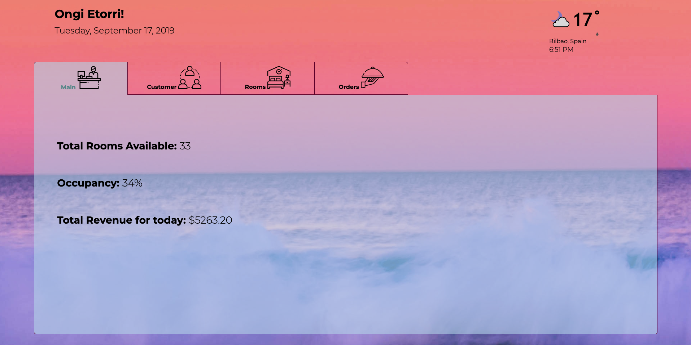
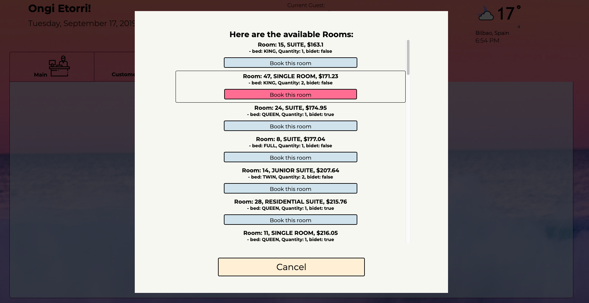
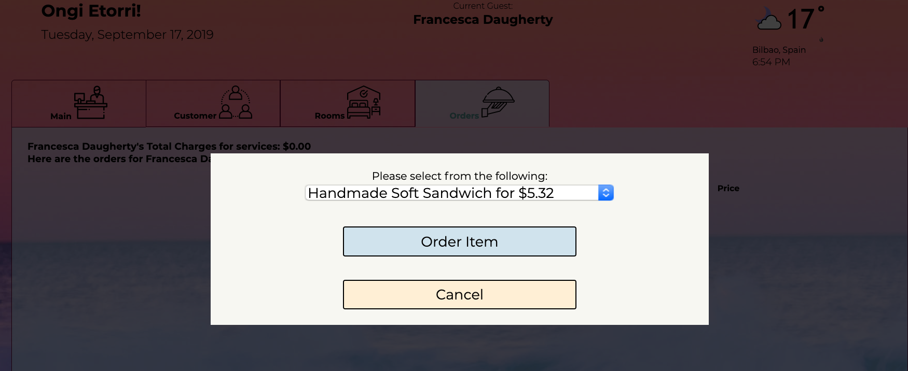

# Abstract
This was a project in which I was tasked with creating a web-page based hotel management application. In the application now, you can see the bookings for the current date, make a new booking for the current day for a selected customer as well as order room service and update the bill for a current customer.

## Technologies
This app was built using the fetch API, jQuery, and SASS.

### To install this application

#### Clone This Repo

1. Clone down this repo using `git clone` .(you replace the `[...]` with the terminal command arguments): `git clone [remote-address] [what you want to name the repo]`
1. Run `npm install` to install the necessary dependencies and the webpack bundler.
1. Once that is done run `npm start` to launch the webpack bundler.
1. Then your terminal should show you a link like this:
`Project is running at http://localhost:8080/`
1. Follow that link in your browser and the application should be running.

